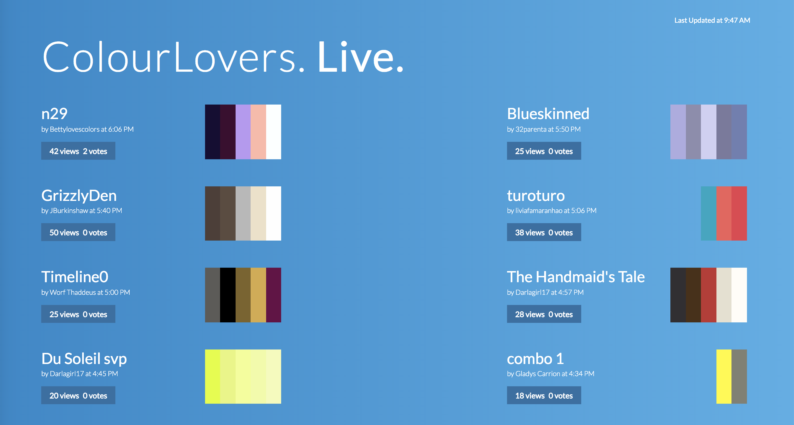
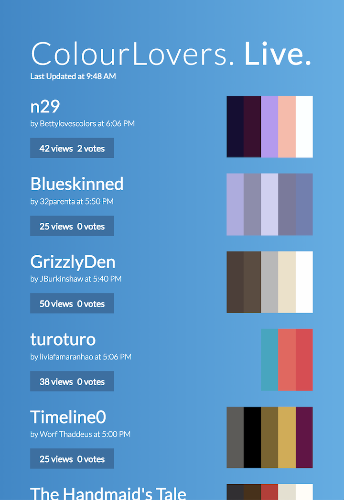

# ColourLovers Live

ColourLovers Live is an exploration of british spelling and intended to keep software engineers familiar with the latest trends in colour palettes. 🎨

To be clear, this is not a complete or comprehensive spec, let me know if anything's unclear and we'll get it hammered out.

## Overview

Really this just a quick toy project using roughly TenantBase's development stack. No need to be OCD. If some particular part of the mockup is really tricky to implement, just note it in the code and have a mental gameplan of how you'd approach solving it.

The actual mechanics shouldn't be too complicated—hit ColourLovers.com's API and display it nicely with some responsive behavior. Here's a mockup of the version for large screens:


### Behavior

When the index.html file is loaded, it should immediately load up the newest colour palettes from the CL API, displaying them as shown in the mockup. The mapping from the API to the UI should be pretty self evident.

The page should refresh the data every minute, so we see the latest palettes.

In terms of mobile/responsive behavior, I've also included a mockup of a mobile version to be implemented using standard bootstrap responsive behavior:


BTW the font is Lato. I've included PSDs in the mockups folder if need 'em to dig further into graphic design details.

### Technical Details

API-wise, you'll want to do a GET against the CL palettes endpoint:

    http://www.colourlovers.com/api/palettes/new?format=json

It will return a list of palettes. Here's an example palette:

```javascript
 {
    "id": 3896580,
    "title": "Tequila Sunrise",
    "userName": "peachcreativeco",
    "numViews": 11,
    "numVotes": 3,
    "numComments": 0,
    "numHearts": 0,
    "rank": 0,
    "dateCreated": "2015-10-09 10:15:22",
    "colors": [
      "9F1F63",
      "D61B5B",
      "F6DC32",
      "F69C1F",
      "67B7A8"
    ],
    "description": "A refreshing tropical palette reminiscent of umbrella cocktails...",
    "url": "http://www.colourlovers.com/palette/3896580/Tequila_Sunrise",
    "imageUrl": "http://www.colourlovers.com/paletteImg/9F1F63/D61B5B/F6DC32/F69C1F/67B7A8/Tequila_Sunrise.png",
    "badgeUrl": "http://www.colourlovers.com/images/badges/p/3896/3896580_Tequila_Sunrise.png",
    "apiUrl": "http://www.colourlovers.com/api/palette/3896580"
  }
```

Further info can be found in the "Palettes" section of the [CL API documentation](http://www.colourlovers.com/api).

Use whatever library of your choice to hit the endpoint. jQuery even.

## Follow-up questions

1) Why did you pick the particular stack/libraries/frameworks that you selected? 
- I chose to use React to develop this project’s UI so I can modularize and reuse my code; specifically, I made a component for the palette cards so they can easily be displayed and re-rendered when new calls to the API are made. 
- I considered using Redux for state management, but realized that’s probably overkill for the scope of this project, so I just passed down state to children components as props when necessary.  
- When working with React I usually use the fetch API, but due to Colours API’s CORS policy, I needed to use $.getJSON in order to successfully get a response
- I used ‘moment’ to format the updated time because moment provides a simple way to work with time and dates in Javascript 

2) What are your thoughts on repository layout? Do you prefer a particular style? ie general organization of code, components, tests, etc
- I like to keep my code as organized and modularized as possible, so within the src folder I keep my components in one folder and my styles in another. If I was using Redux, I would also have an actions and reducers folder.
- In terms of pushing up to the repo, I like to commit my changes everytime I finish a task or find a bug and fix it. I also like to include descriptive commit messages so I/other developers can clearly understand what each commit was for. 
- When working on any project, I usually like to work on functionality first, and design details last. In the past I’ve made the mistake of focusing on design details too heavily to start with, and then having to completely scratch it later down the line when the direction of the project changed, or a component was no longer needed. So I try to follow this routine instead now :) 

3) What are your thoughts on front-end URL routing? Are there any principles that you prefer to follow?
- When I’m working with React, I like to use react-router for navigation and routing - it has great documentation, it’s easy to use, and it allows users to smoothly navigate throughout the app, go back to a previous route, etc.
- Since there was no navigation for this project I didn’t implement react-router, but in the past when I've used it I set all the routes in an App.js file.

4) Do you have any strong feelings on css styling/structures? 
- I like to make a different css file for each component so that the styles are organized and easy to find.
- Within each css file, I organize the styles mobile-first, with media-queries at the bottom.
- I try to assign descriptive class names to any element I want to style, so I can reuse that style in the future and know exactly what I’m styling.
- I’ve recently gotten into the habit of alphabetizing css properties so that it’s easy for myself and other developers to find and add a property in the future.
- For positioning I used flexbox so I can easily change how the cards are laid out in mobile view vs in desktop view.
- With bigger projects I like to use Sass so I can reuse variables instead of repeating colors/sizes/fonts all over the place, but didn’t think it was needed for the scope of this project.

5) If you were to develop this front end further, what future features or improvements would you like to achieve?
- I would capitalize the titles of each color palette so they look consistent. 
- I would attach links to each palette so the user can click on the palette and it takes them to the palette on the website.
- I would include the entire date under each card, not just the time -- the time might be from the day before, but there is no distinction right now.
- It takes a few seconds to get a response back from the API, so perhaps show a loading icon to the users so they’re aware when it’s loading.

6) Anything else that you'd like to share to showcase your talents!
- The screenshots didn’t really show what it should look like on small mobile views, so I changed the design/sizing a tad bit so it can stay responsive down to 320px.
- I had fun working on this challenge and would love to hear any type of feedback (whether it’s something I could have styled better, organized better, etc.) -- I’m always looking to improve so I would really appreciate it!

## Screenshots 


